<div align="center">

# WallpaperStore

**작은 세계를 바탕화면으로.**

HTML · CSS · JavaScript로 만든 15가지 움직이는 배경화면.<br>
오프라인 실행 · 개별 ZIP 다운로드 · 제작자 **aidevksh**

[배경화면 다운로드](https://github.com/aidevksh/WallpaperStore/releases/latest) · [WallpaperJS 앱 릴리즈](https://github.com/aidevksh/WallpaperJS/releases) · [Apache 2.0](LICENSE)

</div>

## 시작하기

1. [WallpaperJS 릴리즈](https://github.com/aidevksh/WallpaperJS/releases)에서 앱을 확인하세요. **2026-09-30 기준 공개 앱 릴리즈는 아직 없습니다.** 그동안은 [원본 프로젝트](https://github.com/aidevksh/WallpaperJS)의 개발 실행 안내를 따르거나 배경화면의 `index.html`을 브라우저에서 열어볼 수 있습니다.
2. 아래에서 원하는 배경화면의 **ZIP 다운로드**를 누르세요.
3. WallpaperJS에서 ZIP 또는 압축을 푼 폴더를 가져온 뒤 디스플레이에 적용하세요. 전체 저장소 ZIP을 가져오는 대신, 개별 배경화면 ZIP이나 폴더를 선택하세요.

별도의 빌드·CDN·API 키·외부 이미지·폰트가 필요하지 않으며, 소리를 재생하거나 마이크를 사용하지 않습니다. 브라우저로 여는 것은 미리보기이며 바탕화면 적용에는 WallpaperJS가 필요합니다.

모든 테마는 **HTML/CSS/JavaScript 실시간 애니메이션**으로 제작합니다. WebM 등 동영상 파일을 사용하거나 배포하지 않습니다. `preview.png`는 목록에서 보여주는 정지 미리보기입니다.

## 배경화면

README에서도 이미지 미리보기가 가능합니다. 아래 PNG는 **실제 배경화면을 렌더링한 정지 화면**입니다. 움직임은 다운로드 후 `index.html`을 열어 확인하세요.

<table>
<tr>
<td width="50%" valign="top">

### [Galaxy](galaxy/)

[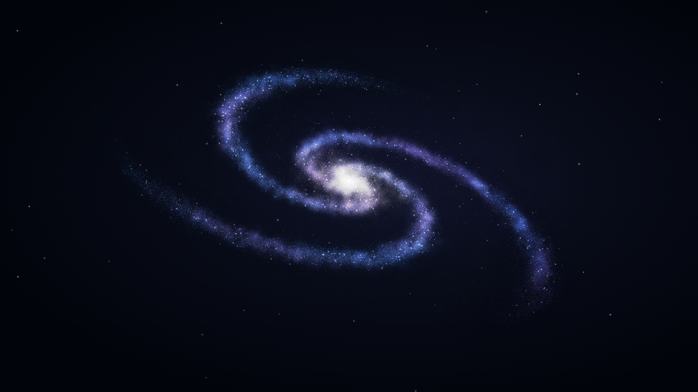](galaxy/)

천천히 회전하는 나선 은하와 보랏빛 성운. 원본 ASTRA를 옮긴 WebGL 배경화면.

[ZIP 다운로드](https://github.com/aidevksh/WallpaperStore/releases/latest/download/galaxy.zip) · [소스](galaxy/)

<sub>aidevksh · Apache-2.0</sub>

</td>
<td width="50%" valign="top">

### [Bunny Garden](bunny-garden/)

[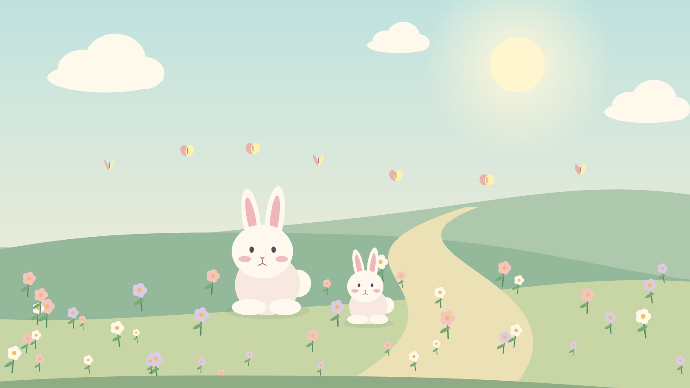](bunny-garden/)

파스텔 정원에서 깡충 뛰는 토끼와 나비, 바람에 흔들리는 꽃.

[ZIP 다운로드](https://github.com/aidevksh/WallpaperStore/releases/latest/download/bunny-garden.zip) · [소스](bunny-garden/)

<sub>aidevksh · Apache-2.0</sub>

</td>
</tr>
<tr>
<td width="50%" valign="top">

### [Coastal Drive](coastal-drive/)

[](coastal-drive/)

햇살 가득한 바다를 끼고 달리는 해안 도로. 야자수와 차선이 흘러가는 드라이브.

[ZIP 다운로드](https://github.com/aidevksh/WallpaperStore/releases/latest/download/coastal-drive.zip) · [소스](coastal-drive/)

<sub>aidevksh · Apache-2.0</sub>

</td>
<td width="50%" valign="top">

### [Neon Rain](neon-rain/)

[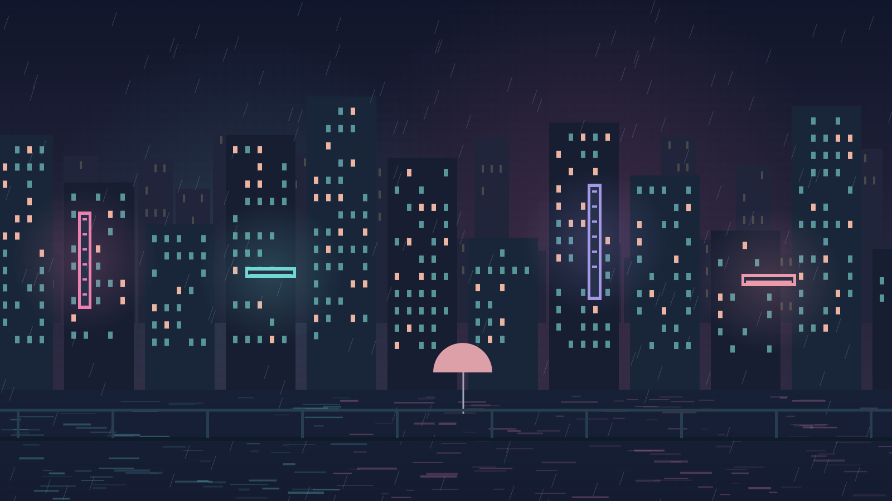](neon-rain/)

분홍빛 네온과 청록빛 창문, 빗줄기와 물에 비친 도시의 밤.

[ZIP 다운로드](https://github.com/aidevksh/WallpaperStore/releases/latest/download/neon-rain.zip) · [소스](neon-rain/)

<sub>aidevksh · Apache-2.0</sub>

</td>
</tr>
<tr>
<td width="50%" valign="top">

### [Bamboo Breeze](bamboo-breeze/)

[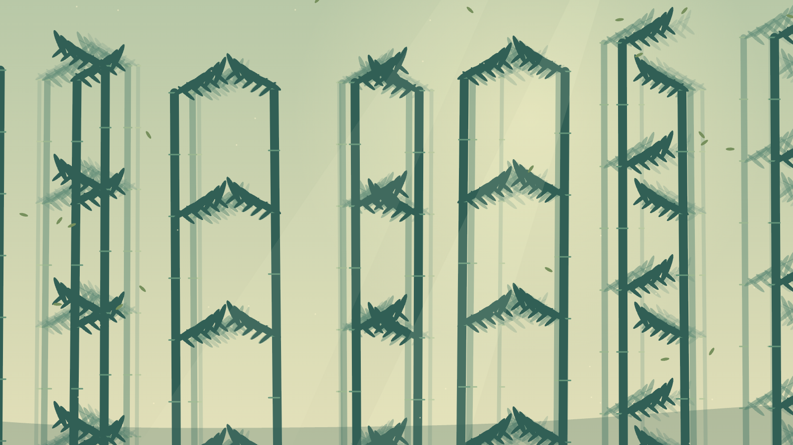](bamboo-breeze/)

안개 낀 대나무 숲 사이로 떠다니는 잎과 따스한 빛.

[ZIP 다운로드](https://github.com/aidevksh/WallpaperStore/releases/latest/download/bamboo-breeze.zip) · [소스](bamboo-breeze/)

<sub>aidevksh · Apache-2.0</sub>

</td>
<td width="50%" valign="top">

### [Aurora Lake](aurora-lake/)

[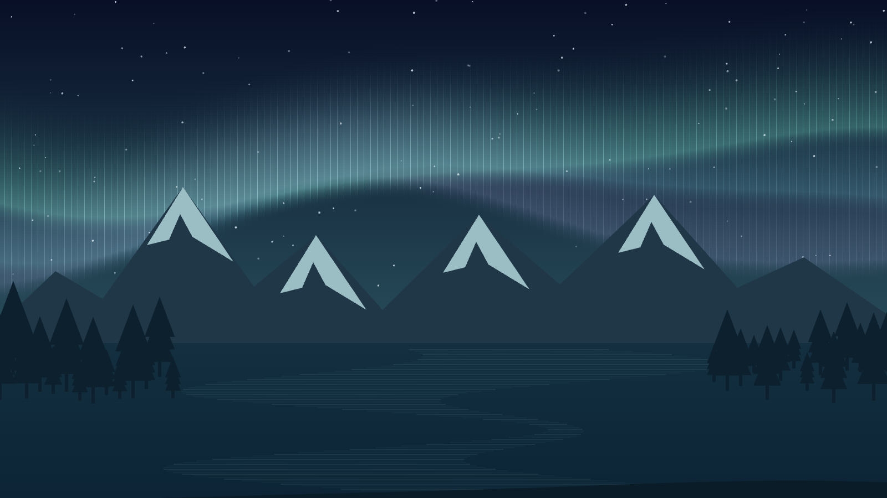](aurora-lake/)

설산 너머 춤추는 초록빛 오로라와 잔잔한 호수의 반사.

[ZIP 다운로드](https://github.com/aidevksh/WallpaperStore/releases/latest/download/aurora-lake.zip) · [소스](aurora-lake/)

<sub>aidevksh · Apache-2.0</sub>

</td>
</tr>
<tr>
<td width="50%" valign="top">

### [Jellyfish Dream](jellyfish-dream/)

[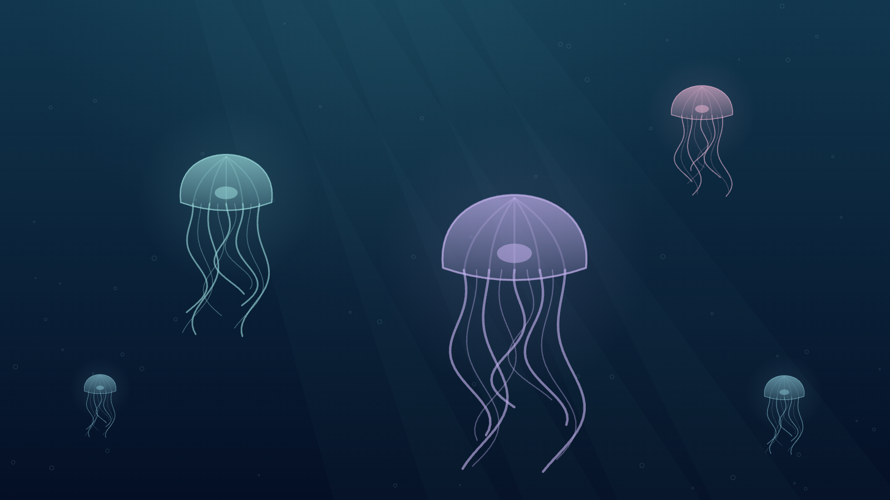](jellyfish-dream/)

깊은 푸른 바다 속 빛나는 해파리와 천천히 올라오는 기포.

[ZIP 다운로드](https://github.com/aidevksh/WallpaperStore/releases/latest/download/jellyfish-dream.zip) · [소스](jellyfish-dream/)

<sub>aidevksh · Apache-2.0</sub>

</td>
<td width="50%" valign="top">

### [Desert Dusk](desert-dusk/)

[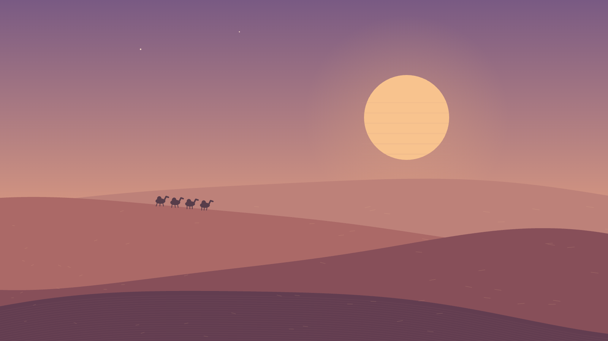](desert-dusk/)

커다란 해 아래 겹겹이 이어지는 테라코타 사구와 날리는 모래.

[ZIP 다운로드](https://github.com/aidevksh/WallpaperStore/releases/latest/download/desert-dusk.zip) · [소스](desert-dusk/)

<sub>aidevksh · Apache-2.0</sub>

</td>
</tr>
<tr>
<td width="50%" valign="top">

### [Cloud Islands](cloud-islands/)

[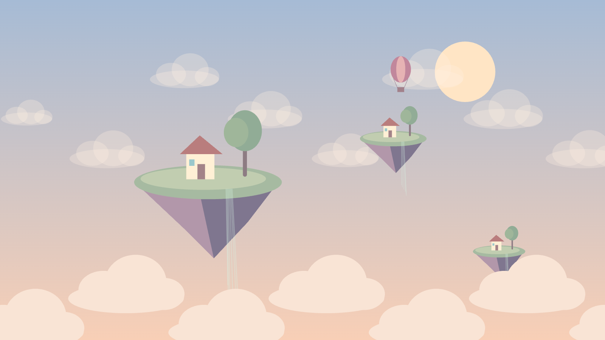](cloud-islands/)

살구빛 하늘에 떠 있는 작은 섬과 풍선, 느리게 흐르는 구름.

[ZIP 다운로드](https://github.com/aidevksh/WallpaperStore/releases/latest/download/cloud-islands.zip) · [소스](cloud-islands/)

<sub>aidevksh · Apache-2.0</sub>

</td>
<td width="50%" valign="top">

### [Koi Pond](koi-pond/)

[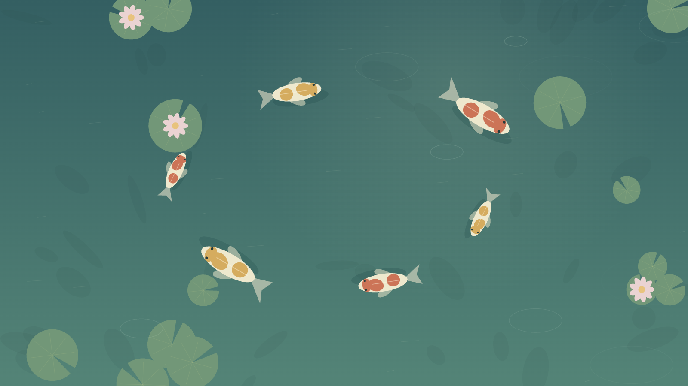](koi-pond/)

수련 사이를 유영하는 잉어와 겹쳐 번지는 물결을 위에서 바라본 연못.

[ZIP 다운로드](https://github.com/aidevksh/WallpaperStore/releases/latest/download/koi-pond.zip) · [소스](koi-pond/)

<sub>aidevksh · Apache-2.0</sub>

</td>
</tr>
<tr>
<td width="50%" valign="top">

### [Silk Flow](silk-flow/)

[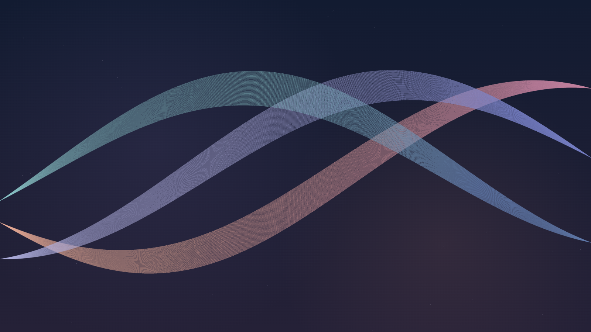](silk-flow/)

짙은 남색 공간을 흐르는 산호빛·라일락빛 리본의 부드러운 추상 애니메이션.

[ZIP 다운로드](https://github.com/aidevksh/WallpaperStore/releases/latest/download/silk-flow.zip) · [소스](silk-flow/)

<sub>aidevksh · Apache-2.0</sub>

</td>
<td width="50%" valign="top">

### [Ember Blade](ember-blade/)

[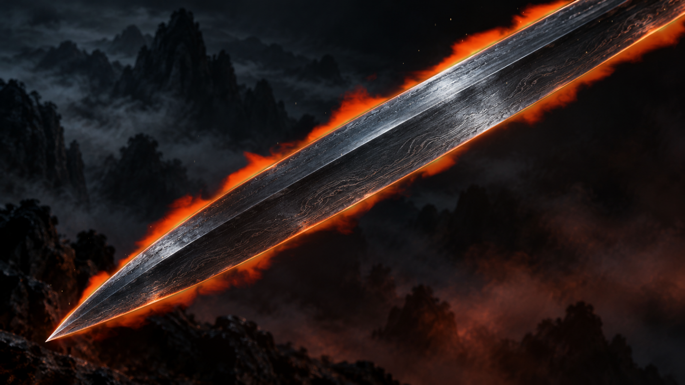](ember-blade/)

좌하단으로 향하는 검날이 화면을 대각선으로 가릅니다. 사실적인 강철 질감과 검날을 따라 타오르는 불꽃, 무협지의 산악 안개.

[ZIP 다운로드](https://github.com/aidevksh/WallpaperStore/releases/latest/download/ember-blade.zip) · [소스](ember-blade/)

<sub>aidevksh · Apache-2.0</sub>

</td>
</tr>
<tr>
<td width="50%" valign="top">

### [Diamond Skull](diamond-skull/)

[](diamond-skull/)

크리스탈과 다이아몬드로 빚은 해골. 보석의 면을 따라 흐르는 빛과 반짝이는 섬광.

[ZIP 다운로드](https://github.com/aidevksh/WallpaperStore/releases/latest/download/diamond-skull.zip) · [소스](diamond-skull/)

<sub>aidevksh · Apache-2.0</sub>

</td>
<td width="50%" valign="top">

### [Midnight Drive](midnight-drive/)

[](midnight-drive/)

달빛과 도시의 불빛을 향해 달리는 한밤의 도로. 흐르는 차선과 가로등, 헤드라이트.

[ZIP 다운로드](https://github.com/aidevksh/WallpaperStore/releases/latest/download/midnight-drive.zip) · [소스](midnight-drive/)

<sub>aidevksh · Apache-2.0</sub>

</td>
</tr>
<tr>
<td width="50%" valign="top">

### [Pixel Voyage](pixel-voyage/)

[](pixel-voyage/)

대항해시대의 범선과 파도치는 바다. 도트 구름과 갈매기 사이로 이어지는 항해.

[ZIP 다운로드](https://github.com/aidevksh/WallpaperStore/releases/latest/download/pixel-voyage.zip) · [소스](pixel-voyage/)

<sub>aidevksh · Apache-2.0</sub>

</td>
<td width="50%">

**나만의 배경화면으로 수정해 보세요.**<br>각 폴더는 독립된 웹 프로젝트입니다.

</td>
</tr>
</table>

## 파일 구성

각 배경화면은 아래 구조를 따릅니다. 폴더 하나만 복사해도 실행됩니다.

```text
bunny-garden/
├── index.html        # 시작 페이지
├── style.css         # 전체 화면 스타일
├── main.js           # 장면 및 애니메이션
├── background.png    # Ember Blade / Diamond Skull의 로컬 정지 원화
├── fire.js           # Ember Blade의 실시간 WebGL 화염
├── wallpaper.json    # WallpaperJS 메타데이터
├── preview.png       # 실제 렌더링 미리보기
├── README.md         # 설명, 다운로드, 제작자
├── LICENSE           # Apache 2.0 전문
└── NOTICE            # 저작권 및 출처 고지
```

Galaxy는 원본 [ASTRA 예제](https://github.com/aidevksh/WallpaperJS/tree/main/examples/astra-galaxy)를 옮겨 이름과 배포 메타데이터를 변경했습니다. 원본 고지는 `galaxy/UPSTREAM-NOTICE`에 보존했습니다. `galaxy/lockscreen-2560x1440.png`는 Windows 잠금화면에 사용할 정지 이미지입니다.

## 실행 및 성능

- Galaxy는 WebGL을, Ember Blade는 Canvas 2D와 WebGL 화염을, 나머지 13개는 Canvas 2D를 사용합니다. Pixel Voyage는 480×270 해상도의 도트 장면을 보간 없이 확대합니다.
- Ember Blade와 Diamond Skull은 함께 포함된 로컬 `background.png` 위에 불꽃·불티·빛의 반짝임을 실시간 합성합니다. 정지 원화는 ImageGen으로 생성했으며 각 폴더의 `ARTWORK.md`에 생성 프롬프트를 기록했습니다. WebGL을 사용할 수 없는 환경에서 Ember Blade는 검날의 열광과 불티를 표시합니다.
- 추가 배경화면은 기본 30fps, 최대 DPR 1.5로 렌더링하며 WallpaperJS의 30/60fps·일시정지 이벤트를 지원합니다. 숨겨진 페이지에서는 애니메이션을 멈추고, 운영체제의 동작 줄이기 설정에서는 정지 화면을 표시합니다.
- 16:9 화면에 맞춰 디자인했으며 창 크기에 맞게 채웁니다. 신규 네 테마는 비율을 유지하며 가장자리를 잘라 채웁니다. 기존 테마는 다른 비율에서 일부 도형이 늘어나 보일 수 있습니다.
- 미리보기와 자동 실행 검증은 Chromium에서 수행했습니다. Windows/macOS 실제 바탕화면 배치와 장시간 GPU 사용량은 환경별 확인이 필요합니다.

## 개발 및 검증

배경화면 사용에는 Node.js가 필요하지 않습니다. 아래 명령은 기여자용입니다. Node.js 22 이상과 Python 3를 사용하세요.

```sh
npm ci
npx playwright install chromium
npm run preview     # 브라우저 검증 및 15개 PNG 재생성
node scripts/preview.mjs --check-only  # PNG를 바꾸지 않고 전체 동작 검증
node scripts/preview.mjs "--only=ember-blade,diamond-skull,midnight-drive,pixel-voyage"
npm run check       # 매니페스트, 필수 파일, JS 구문 검증
npm run package     # dist/에 개별 ZIP 15개 생성
node scripts/check-import.mjs /path/to/WallpaperJS  # 원본 앱의 폴더/ZIP 가져오기 검증
```

설치된 Chrome을 사용하려면 `CHROME_PATH` 환경변수에 실행 파일 경로를 지정하세요. `preview`는 애니메이션 변화, 일시정지/재개, 화면 크기 변경, 외부 요청 부재, 신규 배경화면의 동작 줄이기를 검증합니다.

## 제작자 및 라이선스

**aidevksh** · Copyright 2026 aidevksh.

이 저장소의 코드, 문서, 생성된 미리보기는 [Apache License 2.0](LICENSE)으로 배포합니다. 각 배경화면 폴더와 개별 ZIP에도 `LICENSE`와 `NOTICE`를 포함하므로 단독 배포 시에도 제작자와 라이선스가 함께 전달됩니다. 재배포 시 해당 파일과 기존 저작권 고지를 보존하세요. Galaxy 원본의 WallpaperJS contributors 고지도 함께 보존합니다.
